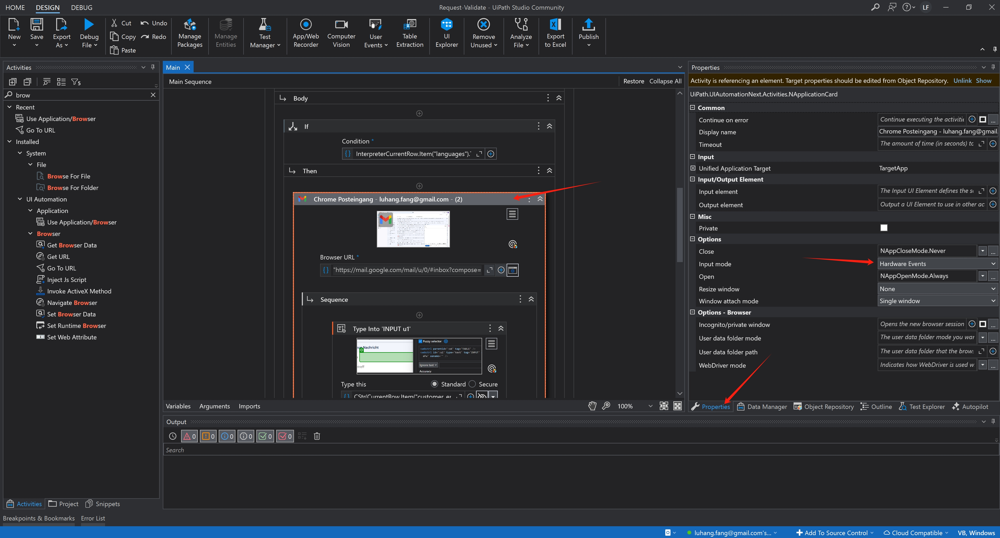

# Uebung3

## Overview
This is a repository for HU BPA Exercise 3, focusing on request validation automation using UiPath.

## Prerequisites
- UiPath Studio Desktop
- Access to required CSV files

## Setup Instructions

### 1. Repository Setup
- Download all files from this repository

### 2. Workflow Configuration
1. Open `request-validate.xaml` using UiPath Studio Desktop
2. Configure the following paths in the main sequence:
   - Update the first CSV file path to point to `request.csv` in the data folder
   - Update the second CSV file path to point to `interpreter.csv` in the data folder

### 3. Browser Settings
Ensure the browser options are configured correctly:
- Set Input Mode to "Hardware Events" in the browser properties
- This setting is crucial for proper automation execution

### 4. Workflow Preview
The image below shows the main sequence structure:

## Execution
After completing the setup, simply run the workflow to start the automation process.

## Important Notes
- Verify all file paths before running
- Check browser settings
- Ensure proper system permissions for automation

---
*For issues or questions, please create an Issue in the repository.*